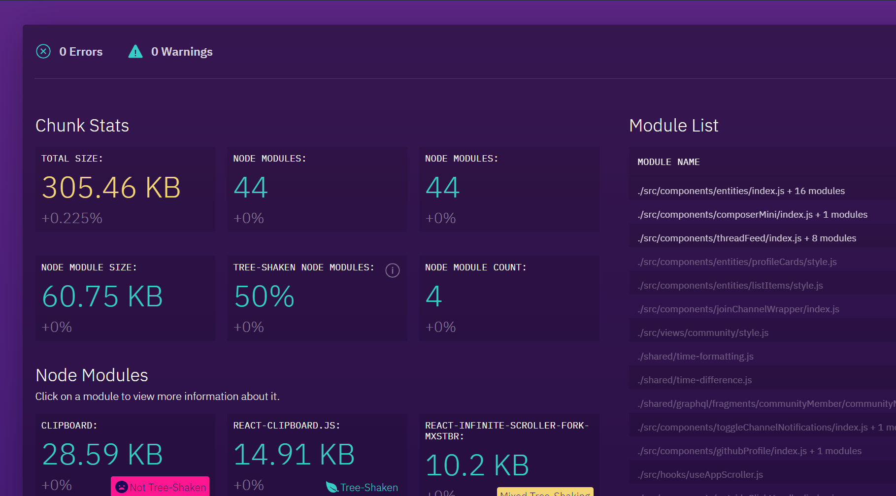

# @mixer/webpack-bundle-compare

This is a tool that allows you to compare webpack bundle analysis files over time. Check it out [here](https://webpackbundlecomparison.z5.web.core.windows.net).



## Usage

The bundle comparison tool takes URLs of webpack stat outputs and displays them. You can use the JSON output from the [webpack-bundle-analyzer](github.com/webpack-contrib/webpack-bundle-analyzer), but we also include a plugin here if you don't use that package.

### Using the Plugin

First, install the plugin.

```
npm install --save-dev @mixer/webpack-bundle-compare
```

Then, add it to your webpack.config.js file.

```diff
+const { BundleComparisonPlugin } = require('@mixer/webpack-bundle-compare');

...

   plugins: [
+    new BundleComparisonPlugin()
   ]
```

By default, this'll output a file named `stats.msp.gz` in your build output. This is a gzipped msgpack file--for large projects webpack bundle stats can get pretty big and slow down your build, so we try to make it fast. You can configure the output format and filename by passing options to the plugin:

```js
new BundleComparisonPlugin({
  // File to create, relative to the webpack build output path:
  file: 'myStatsFile.msp.gz',
  // Format to output, "msgpack" by default:
  format: 'msgpack' | 'json',
  // Whether to gzip the output, defaults to true:
  gzip: true | false,
})
```

Once you have this file, you can upload it somewhere such as Azure blob storage, and serve it in the tool. The module exposes a convenient way to get a direct preloaded link in the tool:

```js
const { getComparisonAddress } = require('@mixer/webpack-bundle-compare');
const link = getComparisonAddress([
  'http://example.com/stats1.msp.gz',
  'http://example.com/stats1.msp.gz',
])

console.log('See your comparison at:', link);
```

## Contributing

### Architecture

It's a React/Redux app. We pull webpack analysis JSON down from URLs, process them, and output UI. State is driven via Redux, and the parsing and unzipping of the (potentially very large) webpack stat files happen in a webworker. Actions sent in the redux state are mirrored to the webworker, and in turn the webworker and send actions which get fired back to the host application. The work we do atop the stats file is not particularly interesting--an assortment of parsing, walking, and graph generation functions.

### Iteration

To develop against the UI:

1. Create a folder called "public/samples", and place JSON files in there. Or use the ones we already have preloaded.
2. Set the `WBC_FILES` environment variable to a comma-delimited list of the filenames you placed in there.
3. Running the webpack dev server via `npm start` will now serve the files you have placed in there.